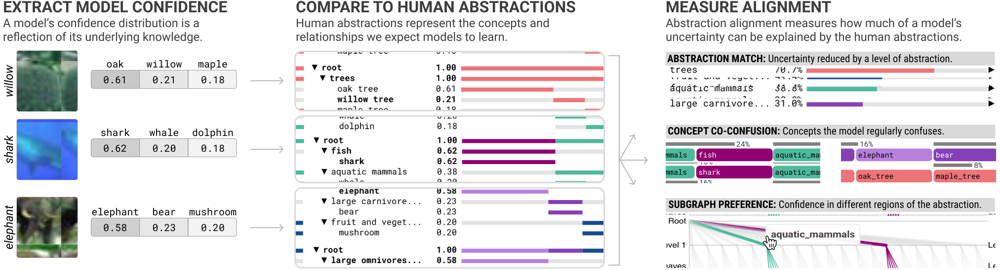

# Abstraction Alignment

<p align="">
    <h3>
        <a href="https://vis.mit.edu/pubs/abstraction-alignment/" target="_blank"><b>Project Page</b></a> | 
        <a href="https://vis.mit.edu/pubs/abstraction-alignment.pdf" target="_blank">Paper</a> | 
        <a href="https://vis.mit.edu/abstraction-alignment" target="_blank">Interface</a>
    </h3>
</p>

**Abstraction Alignment** is a methodology to measure the alignment between model decisions and formal human knowledge. This repo contains code to recreate the experiments in [Abstraction Alignment: Comparing Model-Learned and Human-Encoded Conceptual Relationships](https://vis.mit.edu/pubs/abstraction-alignment/). 

To explore the case studies in an live interactive interface instead, check out the [abstraction alignment interface](https://vis.mit.edu/abstraction-alignment).

<p align="center">

</p>

## What is Abstraction Alignment
Abstraction alignment is a new method for understanding human-AI alignment. By comparing AI decisions against existing formalization of human knowledge, it examines how AI models learn concepts and relate them to form abstractions. Working alongside experts in computer vision, LLMs, and medicine, we find that abstraction alignment enhances AI transparency by revealing if and when models generalize in human-like ways and improves domain understanding by identifying ways to refine human knowledge.

## Getting Started with Abstraction Alignment
Explore abstraction alignment on our three case studies:
- 📷 Interpreting Image Model Behavior: [Notebook](https://github.com/mitvis/abstraction-alignment/blob/main/abstraction_alignment_cifar.ipynb) | [Interface](https://vis.mit.edu/abstraction-alignment)
- 🤖 Benchmarking Lanuage Model Specificity: [Notebook](https://github.com/mitvis/abstraction-alignment/blob/main/abstraction_alignment_llm.ipynb) | [Interface](https://vis.mit.edu/abstraction-alignment)
- 🏥 Analyzing Medical Dataset Encodings: [Notebook](https://github.com/mitvis/abstraction-alignment/blob/main/abstraction_alignment_mimic.ipynb) | [Interface](https://vis.mit.edu/abstraction-alignment)

### Repository Structure

```
# Notebooks to explore abstraction alignment
abstraction_alignment_cifar.ipynb       # Interpreting Image Model Behavior case study (Sec. 5.1)
abstraction_alignment_llm.ipynb         # Benchmarking Lanuage Model Specificity case study (Sec 5.2)
abstraction_alignment_mimic.ipynb       # Analyzing Medical Dataset Encodings case study (Sec. 5.3)
abstraction_alignment_toy_example.ipynb # Additional toy example of abtraction alignment

# Supporting data files to compute abstraction alignment
abstraction_graph_cifar.py
abstraction_graph_mimic.py
abstraction_graph_toy_example.py
graph.py
metrics.py
util/cifar/       # Uiliity files for the CIFAR example
util/llm/         # Utility files and data for the LLM example
util/toy_example/ # Utility files for the toy example

# Code to extract interface data files
extract_data_cifar.py
extract_data_mimic.py
extract_data_llm.py
interface/data/cifar/ # Stores the CIFAR model data files
interface/data/llm/   # Stores the LLM model data files
interface/data/mimic/ # Stores the MIMIC-III data files
```

### Set Up

#### CIFAR-100
The CIFAR-100 data will autmatically download during analysis in the notebooks.

#### LLMs, WordNet, and S-TEST
1. Follow instructions to download the [S-TEST dataset](https://github.com/jeffhj/S-TEST). Put it in a folder called `./util/llm/S-TEST`.
2. Run `python ./util/llm/S-TEST/scripts/run_experiments.py` to compute the model's output on the data.
3. Update the paths in `./extract_data_wordnet.py` to match your file structure.

#### MIMIC-III
1. Request access to MIMIC-III via [PhysioNet](https://physionet.org/content/mimiciii/1.4/).
2. Download the MIMIC-III dataset and update the paths in `./extract_data_mimic.py` to point to it.

### Running the Abstraction Alignment Interface Locally
The code in `extract_{cifar/wordnet/mimic}_data.py` creates the data files needed to run the abstraction alignment interface. Run these if you'd like to run the abstraction alignment interface locally or reference them for the data file set up to run the interface with your own data.

## Citation
**Abstraction Alignment: Comparing Model-Learned and Human-Encoded Conceptual Relationships.** *Angie Boggust, Hyemin Bang, Hendrik Strobelt, and Arvind Satyanaryan*. Proceedings of the ACM Human Factors in Computing Systems (CHI). 2025.
```
@inproceedings{boggust2025abstraction,
  title = {{Abstraction Alignment: Comparing Model-Learned and Human-Encoded Conceptual Relationships}},
  author = {Angie Boggust AND Hyemin Bang AND Hendrik Strobelt AND Arvind Satyanarayan},
  booktitle = {ACM Human Factors in Computing Systems (CHI)},
  year = {2025},
  doi = {10.1145/3706598.3713406},
  url = {http://vis.csail.mit.edu/pubs/abstraction-alignment}
}
```
